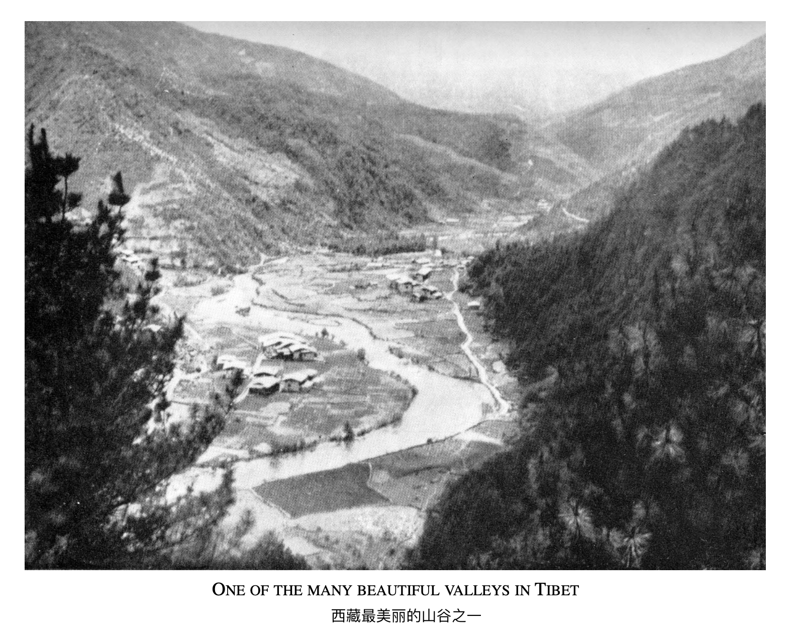

# 第八章

（1）

第二天早上起床的时候，我对我的朋友说：“我知道先知们话里有话，只有达到了很高的灵魂理解力的人才能明白里面隐藏的深意。”&#x20;

“是的，” 他同意道，“一直以来都是这样。但现在我们必须用直截了当地的方式进行我们的谈话。现在是时候把虚假清晰地显现出来了，从而能够理解并消除虚假，然后才能消除世间的痛苦和磨难。在任何情况下，你都不能有所掩饰或者创造关于真理的观念概念；你必须揭露虚假；当虚假被清晰地认知的时候，真理就会存在，因为真理不是被创造出来的。“&#x20;

“从现在开始，我们需要更多地了解细节，以便你能明白头脑的整个（构造）过程 - 也就是头脑造成了人类在世上所有的痛苦烦恼。我们必须比以往任何时候都更清晰地看到虚假。”&#x20;

我从那天的对话里感受到此后的工作强度会更大，事实也确实如此。我必须特别集中注意力，否则我会错过他讲解的要点。&#x20;

我意识到我的头脑现在清晰而敏锐；我能理解他话里更深的含义。

然后他继续说：“今天我们的主题是记忆，因为我希望你能彻底领悟记忆的含义，记忆是造成诸多冲突的根本原因。“&#x20;

“当你获得技能（相关的）知识的时候，如跟科学相关的既定事实，我们称之为事实记忆。如果没有事实记忆的话，我们就无法造出一座桥或者一个发动机，无法造出一辆汽车或者一座房子。你会意识到这种记忆与发生在你身上的不愉快或愉快的记忆是完全不同的。”

“假如有人对你说了一些不愉快的事情，然后另一个人对你说了一些愉快的事情，你会立即陷入（情绪）反应之中，这些反应就成为了记忆。下一次当你遇到那个说不愉快事情的人的时候，你遇到的是那个（不愉快的）记忆，不是吗？你感到不满，但这个感受其实是对昨天记忆的反应。然后你也遇到了那个说愉快事情的人，你遇到的也是那段（愉快的）记忆，你的反应也会大不相同；然而，这两都是记忆在作用，我们称之为心理记忆。“

“我们现在知道了，我们有事实记忆，还有心理记忆，而且心理记忆里存在着确切的反应，但那本身也是记忆。如果你能内观你的头脑，你会发现自己试图保留愉快的回忆，然后丢弃不愉快的回忆。这是一个一直在作用的反应，直到你开始意识到头脑就是记忆，或者说记忆就是头脑，他们在实相中都不存在。“

“那么你会发现记忆-头脑是过去的产物，无论是事实还是心理（层面的）。它的根基都是过去，这是一种条件（限制）的状态。你能明白吗？“

“那我们来更仔细地研究一下这个点。我们遇见新的（东西）——但总是使用旧的回应方式——也就是记忆；那么结果是什么呢？受过去制约的新事物不就是旧事物吗？挑战虽然总是新的，但在体验新事物的时候，（反应）总是受到旧事物的条件制约。在这种情况下，新事物是永远无法彻底被体验的，因为你以旧的体验和反应来体验新事物，这只是徒增旧的体验而已。这样你是永远不可能在自由中体验新事物的，因为你的体验总是受制于过去和旧的事物。“

“如果你审视你的头脑，你会看到自己是如何体验新事物的。如果你的头脑受着宗教偏见、民族主义和理想理念的制约，你是无法理解新事物的，因为旧的（体验和理解）是会障碍理解（新事物的），而这只会不断加强旧事物对新体验的反应。你知道这一切都只是不完整的体验。这种不完整的体验总会浮出来困扰你；这就是为什么专注于一个想法（的明想）意味着压抑所有其他的想法，这也是不完整的。”

“那为什么这种不完整的体验会困扰你？因为它是记忆，而记忆是头脑的印象。但如果你了解了全部的事实，你就会知道真理永远不会是记忆，因为真理是超越头脑的。因此，真理总是新的，没有记忆的束缚。只有有了这种理解，你才能有完整的体验，至此你就有了真正的洞察力，没有了头脑的臆造扭曲。“&#x20;

“如果你用记忆来引导新的体验，你会发现新的已然成为旧的了，不是吗？当你还没有完全理解旧的记忆的时候，你会想要保留它，不是吗？事实上，你不能控制自己不去保留它。只有当你完全看到某件事情的真相的时候，你才会发现在真理里是没有记忆的。”

&#x20;“现在我们来看看记忆养成的方式。你会重复口号祷告语，你会读书，你会有宗教信仰、理想理念和所有其他让你头脑混乱的垃圾。现在当你遇到新的（体验和事物）的时候，你会发现什么？你还是用旧的（经验）体验新的（事物）！然后记忆变得比新的（体验）更为重要，不是吗？”&#x20;

我没有回答；我似乎无言以对。一种蜕变正在发生，我看到了一些我以前没有意识到的东西，我对头脑及其运作的理解变得更加清晰了，当我意识到那就是我自己，一切都是我自己创造的幻象。&#x20;

（2）

“现在，”他继续说道，“我们年轻的时候，会期待未来，我们年老的时候，又会活在过去（的经历里）！为什么会这样呢？仅仅是因为我们没有活在当下。事实上，当我们把未来看的更重要的时候，我们是无法活在当下的；当我们清楚地看到这一点的时候，你就对自己有一个完整的了解，当下的我是不需要记忆的。记忆会障碍自我认知，只有当我们领悟记忆到底是什么的时候，它存在的意义就会消散。”

“如果你仔细观察，你会注意到只有当头脑没有被记忆所困的时候，新的想法、新的感受才会显现。“&#x20;

“如果你没有记忆，那么你的财产、信仰、宗教、国籍就不再重要了。因此，记忆其实加强了自我/小我，这就是冲突的根源，这就是为什么你必须了解记忆，当你了解记忆的时候，它存在的意义就消失了。”&#x20;

“但如果你能明白记忆制造了昨天、今天和明天， 是记忆塑造了今天和明天；你就会明白过去投射出了现在和未来，因为鲜活的当下并没有显现出来。“&#x20;

“你怎么可能通过过去和记忆来认识永恒和未知呢？但这是所有所谓的真理的学生正在努力做的事情。他们试图通过记忆了解实相，这就是为什么他们一直在追寻，却始终找不到（真理）。你的工作就是（向大家）展示这种小我投射（也就是记忆）的虚假性，并展示（大家都）假设这种投射是真实的，但它始终只是记忆而已。“&#x20;

“只有当小我-也就是记忆不再存在的时候，真实才能存在。当你领悟了通过记忆我们是无法体验真实的时候，你就会明白那只是维护了小我，只是一种束缚而已。当你看到这个真相的时候，虚假就会消逝。“&#x20;

“是的，记忆让生活变得乏味和空虚，我们因记忆而活在冲突之中。你现在应该明白了心理记忆是一种束缚，而事实记忆对我们的日常生活至关重要；没有它我们就无法相互交流。”&#x20;

“我现在明白了，”我说，“我必须领悟记忆是什么，才能看到它本来的面目。那么它就不再是体验新事物的障碍。新的永远是新的，不可以用昨天旧的（方式去体验）。”&#x20;

“是的，”他回答说，“当你明白这一点的时候，真实——也就是智慧——将在你的内在和周围运作。”

“你会提及你的灵魂伴侣，但其实你谈论的是一个灵魂伴侣的概念！当你看到这个虚假的时候，你就能获得自由，不是吗？这就是解脱，而真实就存在于解脱之中。你明白了吧？”&#x20;

“是的，”我回答，“我现在明白了。”&#x20;

他说着就起身收起他的长袍走了，留下我一个人继续体会。&#x20;

**\*\*\*\*\***&#x20;

我的头脑正在放弃它旧的记忆伤疤。我意识到那是我的小我，陷在一种觉得自己很重要的错觉里。人们的言行会影响我。记忆不断在我眼前浮现，我现在能够理解整个过程了；所有那些不完整的经历现在都完整了，因为我意识到自己才是冲突的根源，因此这些记忆正在消逝，毫无存在的意义。我客观地审视它们，不带恐惧、怨恨或谴责，因为是我自己造成的结果。&#x20;

当我看到我自己本来的面目的时候，那一刻，我自由了。我，我自己，就是一切的根源。我的反应都是自己的条件限制和自我保护，这永远不可能是实相。实相是没有条件反射的；只有小我有条件反射，而这只是因为我并不了解自己。&#x20;

这种自我揭示就是自由。我明白了那些记忆、思绪、过去、未来，都是我自己，我与他们是一体的。当我看到自己和记忆、思绪、反应是一体的时候，而这些都是我自己创造的记忆的产物，都不是实相，此时，我便不再恐惧、仇恨、虚荣、嫉妒，我不再评判或谴责。现在我知道上师所说的：“不要评判（他人），否则你也会被评判” 的含义了。然后所有这些条件反射的思想记忆都一并消逝了。我看到记忆不是真实的，只是自我创造的自我束缚而已。&#x20;

我不知道你现在是否能感受到通过自我认知而获得的自由。以这种方式蜕变着，实相会无限地运作，你只能每一瞬每一瞬地去体验它，因为生命是活生生的当下，没有任何条件限制。那么，活在当下就是生命的瑜伽。

\*\*\*\*\*

直到午饭的锣声响起的时候，我才回到这个时间的世界；我有一种永恒的感觉，那对我来说无比地真实。&#x20;

我的朋友已经去了镇上，我在大厅里遇到了他。他搂着我的肩膀说：“每次我看着你的脸，我都能看到蜕变。”&#x20;

他补充道：“我有一个好消息告诉你。诺布和她的家人回来了，很想见到你。诺布非常漂亮；我想你已经在她身上唤醒了一种发自内心的、需要被理解的爱。她今天说起你的时候，我从她的眼里看到了这一点。”&#x20;

他停顿了一下，说：“不过我要警告你，你很有魅力，否则你不可能成为疗愈师。你看，诺布问我她是否可以来家里帮忙，洗衣服，并照顾你的起居。我无法拒绝她，因为我们是不会拒绝一份服务的礼物的，通过无条件的服务，爱就产生了。”&#x20;

我回答说：“我完全明白你的意思；我以前经历过在服务中表达爱，我明白这意味着什么。”&#x20;

“是的，”他说，“真正的爱是发自内心的，不是头脑层面的。爱不是一种思想，它更深刻、更深沉。没有爱，生命就没有意义。那是大多数人活着的悲哀；他们尚未成熟便已老去了。他们读书和谈恋爱，却从来不知道生命真正的味道，所以错过了爱的温暖和生命的丰盛。没有爱的品质，我们是永远无法解决任何问题的。“&#x20;

“无法在思想上保持贞洁，其实就是因为其中没有爱。真正的爱是贞洁、纯洁、不朽的。用逻辑来解决问题是荒谬的；用宗教来解决问题是幼稚和愚蠢的。用暴力或禁忌来约束，只能表明我们对关系缺乏（真正的）了解。我们要在关系中意识到我们思想-感受-反应，这是一个自我认知的过程，而真实就存在于其中。"

“只有彻底地了解自己，才能达到超越自我的境界。我们不能创造爱，当小我消逝的时候，爱就会显现。”&#x20;

**\*\*\*\*\***&#x20;

我越是在我的朋友旁边，听他的讲解，我就越能体会到他博大的智慧和理解力。和他在一起的时候，甚至不需要说话，都能让我体验超越小我、超越头脑的东西，头脑里的东西还能够用语言来表达，而超越头脑的东西难以言表。只能够体感。

