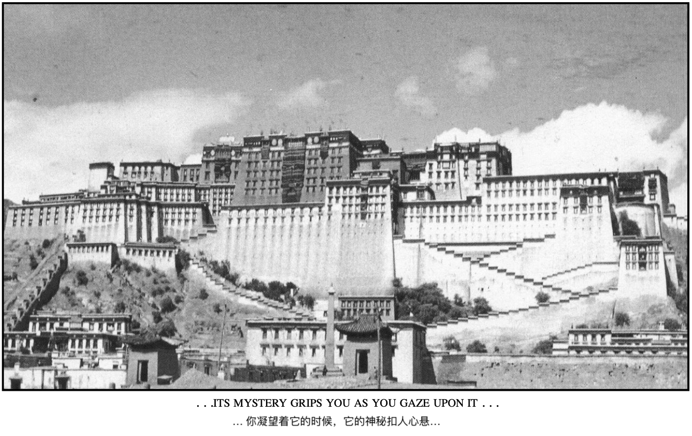
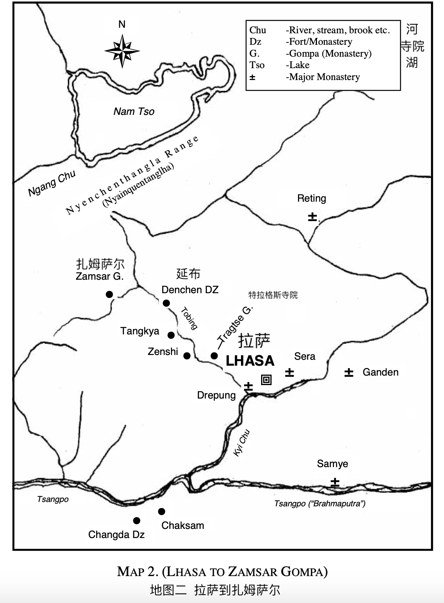

# 第二章

（1）

我凝视着世界上最伟大的四座宗教建筑物：伦敦的圣保罗教堂，罗马的圣彼得教堂，坐落巴格达14英里外的底格里斯河上卡濟米耶的神圣清真寺，以及此时的拉萨布达拉宫 - 着是最独特也是世上最难到达的地方，我都在此生到达并见识了。也许世上只有极少的人做过同样的事情吧。&#x20;

作为佛教中心的布达拉宫，代表着占了世界五分之一的人口的佛教信徒。所有信奉佛教的人都仰望拉萨的布达拉宫，这是伟大的达赖喇嘛所在的地方，而达赖喇嘛又是所有佛教的精神领袖。&#x20;

布达拉宫建在拉萨平原中部一块巨大的岩石上，拉萨河从平原穿流而过。这座宏伟的布达拉宫建筑高达 400 英尺，长近 1000 英尺，包括所有附属建筑在内其占地面积将近1.5 平方英里，四周被雪山环绕。这座参天的纪念碑外墙由石灰粉刷成，有十七层楼高，建于十六世纪，在我们西方还没构想出摩天大楼的时候就建造完成了。（布达拉宫的）建筑工艺也许是世界上最好的，它久经沧桑依旧屹立不倒。当其他摩天大楼坍塌成废墟的时候，它镶金的屋顶依旧在阳光下闪闪发光。这绝对是出自流传千古大师级建筑师的灵感和工艺。

布达拉宫在数英里内是独孤高耸脱颖而出的建筑物。月光下的它，洁白的墙面尤为突出，仿佛反射着一种诡异而不可见的光，耀眼夺目。它有种神奇的品质；你凝视它的时候，那种奥妙神秘的感觉会将你深深地吸引。&#x20;

天空如蓝色的华盖，闪耀着数百万颗星星，满月的光辉有种空灵的感觉，仿佛我们被转移到了另一个世界。

远处可以听到喇嘛深沉的声音，重复着唱诵着熟悉的祷告语 _Om Mani Padme Hum （六字真言）_，伴随着大锣低沉的音调和铜钦的声音，与成百上千个小铃铛的叮咚声交织在一起，让我无比的着迷。尽管我之前已经听过这种奏乐，但今天晚上我却越发地叹为观止。是的，这是史上最迷人、最神奇的景观和声线。&#x20;

我对我的朋友说：“这真是无与伦比啊。” 他还在沉思着，我的声音貌似唤醒了他，他有点吃惊地看着我说：“你说什么？”&#x20;

我发现我无法重复（刚才的）那些话，于是我说：“这一切真是太美妙了。” 他笑了，仿佛封存已久的记忆在他脑海中流逝而过。&#x20;

尽管布达拉宫是纯粹的西藏建筑，但它还让我想起了阿拉伯和埃及。它庞大的体积让我震撼不已，它的色彩和结构更是让我着迷。

它非常自然地融入于周围的环境中，给人一种非人所为非人所造的感觉，仿佛是被隐形的手用某种方式放在了那里。（周围的）树木、白雪皑皑的山脉、附近的湖泊、月光下闪闪发光的镶金庭院、闪烁的星光、喇嘛的唱诵声、高喊声，低沉的大锣声、铜钦声和数百个小铃铛的叮咚声，一切都相互交织着，在我心中烙下了永生难忘无法磨灭的记忆。&#x20;

我的朋友与许多当地官员非常熟络，他获得了参观布达拉宫的许可，我们第二天就可以参观布达拉宫的部分区域。我在极短的时间里见识了太多的东西，所以只能挑重点描述。

我印象特别深刻的是是达赖喇嘛精美的卧室。墙上装饰着大量镶金的图像、镶金的饰面和花押字图案。

还有一个宝座室，镶金的屋顶、精美的镶金真丝锦缎，深紫色和金色相间，均由大师级的工匠精心设计制作而成。

达赖喇嘛的坟墓中，有成百上千的金银杯子和碗，墙上挂着金银图像、镶金的饰面、金银细丝镶嵌的饰品盒，里面放着珠宝装饰的图像。我忍不住想这多浪费时间和金钱啊，一屋子（金银财富）只是为了存放死去腐烂的尸体。整个过程让我无比震撼，我从未见过此番景象，此后也许再也不会见到吧，如此丰盛的财富被收藏起来却没有为任何人做任何的用途。

达赖喇嘛坟墓的外层也是镶金的面板。我敢肯定仅这栋建筑，就用了价值数百万英镑的黄金。

由于我们的时间有限，而且我们还有比欣赏所有这些财富更重要的工作，第二天早晨我们就出发前往了萨姆萨尔。

那天晚上我们到达了特拉格斯寺院。这个寺院高高地坐落在山腰上。我们看到它的时候，我对我的朋友说：“在岩石表面上建造如此巨大的建筑物似乎是一项不可能的任务。他们怎么把巨大的木材和石块放在上面的呢？” 在我看来，这是人类无法完成的任务啊。

我的朋友回答说：“你看到的那座建筑已有600多年的历史了，建造至今牢固无比。它将再屹立600年，依旧坚实如今。”

有一个让人愉悦的惊喜正等着我。我看到了格什·仁波切走下来与我们相见！我的朋友显然知道（这一切），但并没有透露给我。当我看到他那德高望重的面孔，内心无比的喜悦，他带着知情的微笑和深意，说道：“你看我比你们都要先到这里呢。”

那天我们走了十五英里，但再次见到他的喜悦消除了我的疲倦。现在我知道了为什么我的朋友总是说我们必须赶紧赶路。

当我们到达寺院的入口的时候，住持在那迎接我们。他个头高大，肩膀宽大，大约55岁。他微笑的时候，会露出完美的牙齿。他面善且额头大显示着极大的智慧。他的声音柔和而低沉。他只讲藏语。但我能感受到他的温暖，我知道格什·仁波切为我跟他打点过。&#x20;

我的朋友还是充当了翻译，尽管我能听懂其中一些内容，但还是无法完全听懂所有对话的内容。&#x20;

我一定是睡着了，因为我感觉到我的朋友的手拍了拍我说：“我们要吃晚饭了，吃完再上床睡觉。明早，我们都会再次会面。”&#x20;

我很疲倦，就没吃太多东西，然后我在住持主卧室旁的一个小房间里，在里舒适的沙发上睡下。&#x20;

直到第二天早上我才醒过来，我累的像是服了药一下就昏睡了过去。你感受过那种健康的疲倦嘛？你想做的就是躺下睡觉，衣服也不脱，这就是我那晚的感觉。&#x20;

在拉萨的两天塞满了仿佛一整周的行程，而且再次与格什·仁波切相见也让我（的情绪精力）到了所能够承受的极限。我听到格什·仁波切用藏语对住持说：“我的孩子累了，他现在必须休息了。”&#x20;

我从来没感到如此的疲倦，也确实很高兴能安心入睡了。&#x20;

我的头碰到枕头的时候，立刻就睡着了，完全失去了知觉直到第二天早上听到铜钦声。我们都在住持的院内一起用早饭，然后出去看远处山谷深处。我真心觉得我还可以在这里休息一天，我告诉了我的朋友。他说：“那挺好的，因为格什·仁波切也希望我们跟他在一起呆上一天。”

我问道：“他为什么而来呢？” 我的朋友解释说：“他对你非常的依恋；他把你看作自己的孩子，甚至更多；他长途跋涉来到这里就是为了再次见到你。”

就在此时他来到了我们身边。他用胳膊搂着我的肩膀，问：“你在这看到我吃惊吗？” 我说见到他我真是无比的高兴。“事实上，昨天我们上山的时候，我一直想着你，我也告诉了我的朋友。而他只是会心地一笑。但当我看到你的时候，我内心真是欣喜若狂。”&#x20;

我不知道再怎么更好的表达了。这就是我发自我内心自然的（表达），他也知道，因为我感到突然从他那里传来一股暖光像电流一样穿透了我，他的脸如阳光一般明媚亮眼。他说：“那我们去那边坐下吧。”&#x20;

我们走到了凹谷处面向谷底，那里正是齐亚河（Kya Chu）流入托比河（Tobing Chu）之处，有一段平稳蜿蜒曲折，另一段则河水撞击巨石，在空中溅出白色浪花。&#x20;

住持和我的朋友正投入的交谈。因此我们两有了独处的时间。&#x20;

格什·仁波切说：“我确实希望你能继承我毕生所学。希望你看到所有的虚假，因为只有这样，你才能找到真理。”&#x20;

我说：“是的，离开你以后，我的思想一直在蜕变着。我现在知道头脑中没有任何东西能够揭示真理。想法、经验、甚至是几代人累积的思想都无法揭示真理。“ 他说：“我的孩子，确实如此，头脑能产生的也只是真理的投射而已，并不是真理本身。”&#x20;

我当时希望他能继续跟我讲述生命瑜伽。他一定是读取了我的想法，因为他突然就像以前那样，讲话的时候闭上了眼睛。然后他用带着魔力的声音开始讲话，每一字每一句都对我都有深远的影响。我不只是在听这些话语，而是通过听来让我了解自己，认知到那个隐藏和掩盖真实的小我。他的话音如同一曲音乐，我们就像回到了过去的时光。如果你读过我的《超越喜马拉雅》一书，你就能明白我的意思。

他这么说道：“只有真正的明想才能揭示真实。尽管你不会知道真实是什么，但是你会意识到头脑是永远无法揭示它的。头脑、已知的是永远无法揭示未知的。头脑仅仅是想法、记忆、经历，这就是头脑的全部构成，头脑永远无法揭示真理。大多数人所认为的真理只是他们头脑的投射而已。他们也许会读到关于真理的东西，也许会听到别人说（真理），但现在你知道那并不是真理。真理只能从内在显化出来，从来不能从外在获得。 ”

我回答道：“是的，我跟你一起在林玛唐的时候就意识到了这一点。我现在意识到，专注于一个念头只会让头脑思维变得更狭窄，而狭隘的头脑是永远无法理解无限和不可估量的。甚至（可以说）祈祷也不算是真正的明想。通过重复单词和句子，人们可以让头脑安静下来，并在这种寂静中获得回应，但这种回应不是实相的回应，它是无意识的头脑的回应，因为祈祷是一种乞讨，祈祷恳求时永远不会有创造力的。在祈祷中，总是二元对立的，一面是乞讨，另一面是给予。你为自己没有的东西祈祷，（祈祷）汽车或是美德等等。”

耶稣说：当你祈祷的时候，要相信自己已然拥有了。这就是当下的礼物。一切都在当下。明想实际上是在弄清头脑是由什么组成的。当下，不是不久之后，而是此时此刻。&#x20;

“你的头脑是由你的条件反射所构成的，条件反射总是想在头脑中展现自己！要了解自己，你必须意识到自己当下的思绪；你意识到了，就不会活在昨天或者明天里了。因为当头脑不再胡思乱想的时候，实相就出现了，而实相永远存在于当下。“&#x20;

“是的，”他继续说道，“真正的明想是指一种能够敏捷可塑、能深刻广泛觉察的能力，并且是无限的，这样每遇到一个问题都能立即解决，每一个挑战都能立刻了悟，（回应是当即的，而不是）过去的回应。真正的明想是一种自我认知。不以自我认知为目的明想就不是真正的明想，而只是一个（意识）收缩的过程，永远无法揭示任何东西。”

我说：“自我认知就是要知道头脑中所有有意识的和无意识的活动，无论是在清醒的状态还是在所谓的睡眠中。你向我证明了这并不困难，但有时我还是会感到不安。”&#x20;

“这是因为你还在追寻一个结果，我的孩子，” 他解释道。 “我们来试着不去想会发现什么，那么你总会发现新事物。新颖性是不会来自于记忆的，对吧？记忆不是新的，对吗？跟着我一起明想，一步一步地照做。我们在尝试找寻的，不是明天，而是活生生的当下。“

（2）

“首先你得认识到没有自我认知的明想是毫无意义的；自我认知无所谓高低；你的高我的低都仅仅是一个概念而已，都是头脑和时间的产物，而时间是无法揭示永恒的。因此在真正的明想中，专注于高我是毫无意义的。实际上，明想是用来揭示思绪形成的全过程的，也就是记忆，这个（我们）可以立刻实现。真理与时间无关；真理就是当下，否则它永远也不会是（真理）。时间永远无法揭示永恒。记忆和思绪都是时间的产物，不是吗？那小我是什么呢？显然它是记忆，无论高低（高我或小我），它也只是记忆而已。就像我说的那样，关于高我和小我的概念仅仅是一种臆测，是头脑的产物，不是吗？如果你深究，你就会发现事实确实如此。高我和小我只是观念 - 是你从某处读过（听说过）的东西而已，你对其进行了思考，然后你认为它是真实的，但事实并非如此。”&#x20;

“你可以称呼高我为阿特曼灵魂（Atman），但这也只是头脑里的一个概念。当你称其为阿特曼的时候，你把它放置于较高的层级，但它仍然只是记忆的一部分。因此要理解 “自己” 的整个过程，我必须理解记忆、思想、思绪，他们都是一回事。没有思绪或记忆就不会有小我。因此我必须了解记忆，不只是一分钟前或昨天的记忆，而且几个世纪的记忆 - 记忆是随时间累积的经历，以及过往带来的所有的影响。这些都是记忆，无论是存在于意识表层的还是埋藏于深层的。“

“但研究每个细节都需要时间，尽管时间永远无法揭示真理，因为真理是永恒存在于当下的。所以用时间（去揭露真理）是毫无用处的。但大多数人还是习惯用时间来揭示永恒，而真理对他们来说一如既往的遥不可及。我们现在意识到思绪是记忆的产物，而记忆必须即时被化解消散。”&#x20;

“现在，”他继续说道，“你看到的小我，不过是一堆记忆以思绪的方式投射出来。思绪和小我是不可分割的；他们是一体的。这不会是真理，也不能揭示真理。但我们必须超越头脑、超越记忆、超越时间。_但只要记忆还在作用着，那么一切仍旧（存在于）时间里，而时间不是实相_。”&#x20;

我并没有回答，因为（真理）变得越发的明朗，而且蜕变正在发生 - 我意识到了以前从未意识到的东西。我现在意识到头脑不过是时间、记忆、思绪的产物；我意识到要获得自由，头脑必须认清自己永远无法揭示真理。不论是有意识的还是无意识的，高我或小我的记忆都无法揭示出超越（记忆的真理）。我意识到头脑（小我）永远无法揭示真理。只有停止思考真理，我才能体验真理。当我意识到这一点的时候，（我的）头脑变得寂静，不是被迫的寂静，而是因自由而来的如如不动。我不再希望成为任何人。_成为（什么人）的欲望就此消失了；我的头脑永远无法将头脑本身蜕变成真理；头脑也找不到真理。_揭示真理是必须如如不动的。有一种与时间无关的寂静，不是被迫的寂静，而是通过理解了悟而获得的如如不动，至此头脑不再絮叨，那种寂静中便是真实，未知亦就此显现了。这就是创造力。我对结果无所诉求。一切行动都停止了，思考也停止了，这是思考最高的形态，这是（真正的）创造力。我的思绪不再是记忆的表达，不再是过去，不再是我认为正确或不正确的。我看到的是它们本来的样子，也不再为它们所束缚。所有智力活动都停止了。我不再徘徊或怀疑。现在既没有思绪也没有思考者，既没有经历也没有经历者。再也没有通过记忆、通过时间的体验了。只有一种正在体验着的状态，时间也随之消失。昨天、今天、明天已经完全停止了；他们只在头脑中才真正的存在。不被时间所困的头脑就不再有时间（的概念）了，没有时间的头脑就是永恒的，没有开始，亦没有结束，没有原因，也没有结果，没有因果才是真实的。生命履行着自己的职责。这就是完整的创造力。&#x20;

我现意识到真理是即时的，头脑、时间的产物都已全然停止了。我立刻意识到所有思绪都是时间（的产物），每个人类的问题都可以立刻解决，不是以后而是立刻解决，因为实相中是没有问题的。只是人类创造了自己的问题，意识到这一点就是解决所有问题的方法。&#x20;

我意识到所有人类的问题都是记忆的产物，经验的产物和时间的产物。我知道记忆不能解决这些问题；他们无法在其相同的层面上解决这些问题。但当记忆停止的时候，它们会立刻被解决掉。它们在永恒中并不存在；它们只在时间中存在，而时间只在头脑中存在，而问题亦是如此。生命所在之处，别无他物，人类一切的问题都将在爱与智慧生命之中化解。&#x20;

当我意识到这一点的时候，创造力就应运而生了，我知道一切安好。无限是唯一的实相。我不只是一个自动的机器，而是一个活生生的创造之道，无处不在，没有起点，亦没有终点。现在我知道了自我认知的含义。小我在实相中并不存在，知道这一点后，我意识到实相就是解脱。&#x20;

所以当下是唯一的时间。没有明天、没有昨天 - 当它们遮盖了当下的时候，就不能意识到此时此刻。所以明想不是用来集中注意力的 - （集中注意力）是意识紧缩、排斥的和有所限制的。而明想是自由的，脱离时间的自由。

现在我知道只有一个（一元）- 永远鲜活的一元。没有二元性、没有对抗、没有欲望、没有渴求、没有过去、没有未来，所有这些都是我头脑的产物，是带着分离感的我。生命和我是一体的，生命的瑜伽是唯一真正的瑜伽。我和我所拥有的都已然消散，只有全一体的才是真实的：水滴成大海。我现在知道上师所说的 “生命与我合而为一” 的意思了。这不是一个概念，这是实相。思考是永远不可能创造真实的，因为思考是时间的产物；思想是无法揭示永恒的。我现在明白了。只有思考-这个记忆的产物停止运作了，当（记忆）持续的一切结束的时候，永恒的生命才会应运而生。&#x20;

在这种未被创造的寂静中，就是‘存在’，从记忆中解脱出来，从时空中解脱出来，一瞬一瞬的就是永恒存在的当下。&#x20;

我现在知道了其实并没有高我亦没有小我；那也是一种分离，纯粹是头脑的创作。无论在什么层次上，这个我都只是一个概念，作为时间产物的概念，就只是一种幻象而已。&#x20;

就在此时，我的朋友和住持来到我们这里，在我们旁边坐下。我的朋友说：“我们在等你们俩回到这个时间的世界，才来打扰你们。”&#x20;

他说：“你可知道，这是格什·仁波切最喜欢的圣所之一。你从扎姆萨尔邦回来的时候，他就会在这里等你，你们会一起回到林玛塘。我们还不能让你独自上路。”&#x20;

我回答道：“这实在是太好了。”&#x20;

剩下的时间里，我们都在谈论着拉萨和布达拉宫的事情。&#x20;

快到中午的时候，一位喇嘛过来说午饭已经准备好了。我想知道（中午）会吃什么，我看到有美味的大麦汤和精心烹调的羊肉，可口的大麦黄油面包，当然还有藏茶，这都给我留下了深刻的印象。我现在已经习惯并喜欢上了这种茶，尽管起初它喝起来像蓖麻油。这是由茶叶、牦牛黄油、盐和沸水混制而成的茶，真是奇妙的组合

格什·仁波切告诉了住持所有关于我的事迹，住持用藏语说：“我希望能说你的语言。我很想听听你的工作以及你去过的地方。” 很有趣的是，我发现我居然可以用藏语进行普通的对话，虽然我的口语还不标准，但他也能听懂我说的话。交谈结束后，我的朋友和格什·仁波切都鼓起掌表示对我的藏语的认可。&#x20;

下午我们参观了寺院。这座特拉格斯寺院（Tragtse monastery）总共有大约 500 名喇嘛。寺院的正面就在岩壁的边缘；到谷底的落差超过 1000 英尺。寺院的建造肯定是项艰巨的任务。寺院大堂里有棵大树，其枝干支撑着屋顶。 “他们是怎么把它弄上来的？”我问道。&#x20;

他回答说：“全是靠人力和手工，许多双手用好几根绳子绑着树，一起把它从山谷拉上来。巨石被凿开，从岩壁上被炸开。你知道藏族的建筑师，也许是世界上做这类工程最出色的建筑家了。

” 所有寺院都差不多，而这座寺院的独特之处在于它建在高山岩面上。山谷下面，寺院之前，齐亚河（Kya Chu）与托比河（Tobing Chu）交汇相融。河水冲击着巨石，水流咆哮犹如火车轰隆声。

我们早晨会沿着齐亚河前行。我们离扎姆萨尔邦就只有两天的路程了。&#x20;

这是神清气爽的一天，我带着充盈的感觉踏上了旅途的最后阶段。我特别期待看到那个听说过多次的我的朋友的圣所。

&#x20;                                                                  \*\*\*\*\*

那晚我和前夜一样睡得很香，感觉自己可以一天完成两天的旅程。我告诉了我的朋友，但他笑着说：“我的孩子，这可是三十英里的路途，还是很艰难的。大部分的旅途你都必须徒步前行，因为有一些非常危险的地方，最好不要骑在小马背上过去。”&#x20;

我们早上六点左右启辰，计划当晚上到达一个叫德钦（Dechen Dzong）的地方，然后第二天晚上就能到达扎姆萨尔邦。我们的小马被安置在寺院里，我们愉悦地跟他们告别，因为我们还会再见。背着装满食物的行囊走下岩壁台阶，这比攀登上来还要困难得多。我们骑上小马随即出发。我呼吸着清新的晨风，感到无比的兴奋，看着水流过巨石，向各方溅起白色的浪花。美妙而壮丽的风景本身就让人兴奋不已。&#x20;

极少的西方人能够（旅行）超越拉萨，因此我迄今都觉得那时的经历有着特别重要的意义。

