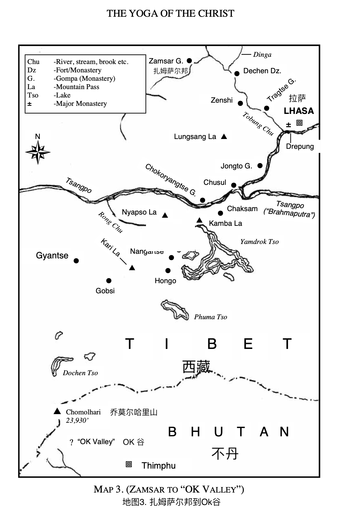

# 第十四章

（1）

扎孜寺是西藏最美丽的寺院之一。扎孜寺高耸屹立在山头上，面向被冰雪覆盖的托冰楚山谷。我们能遥望到拉萨布达拉宫金色的屋顶，在阳光下闪闪发光。

一年中的这个时候，夜晚很冷，日落后一切都被冻住了。湛蓝的天空万里无云，数百万颗闪烁的星星照亮了晶莹剔透的雪花，在整个山谷上投下一层朦胧的白昼。大雪降临的时候，大风带来暴风雪，积雪超过十英尺深。暴风雪来临的时候，你看不到前方几码的地方。

每天我们都能看到牦牛列车和驴子列车在山谷里跋涉，载着货物进出西藏。无论是暴风雪、阳光还是下雨，冬去春来的规律不变。

我知道有一天我也会回到 Ok 谷，然后前往大约200英里外的林马塘和卡林邦，前往 Ok 谷的旅程大约两周后开始，跨过冰雪覆盖的河流和关口。

冬季旅行的时候，格什·仁波切会带着许多人与他一起骑着牦牛前行。牦牛走在前面，在雪地上划出一条小路。牦牛是喜马拉雅山口最好的雪犁。几头牦牛在雪地里跋涉，很快就能在险恶的山口上开辟出一条小路。

我们达成一致在回程的路上绕过拉萨，因为在官员身上浪费时间并没有什么用处。

所以我们启程的那一天，大家都兴致勃勃。我们走下陡峭的台阶，从寺院来到下面牲口等我们的地方。

贸易路线延伸至嘉楚河和丁嘎勒河交汇之处。

我们往右走上岔道，岔道与嘉楚河和丁嘎勒河形成了一个三角，然后我们沿着这条路（不是贸易路线）前往一个叫做南帕的地方。虽然这条路走的人不多，但路况还是不错的。这条路从拉萨分叉出来，位于嘉楚河和丁嘎勒河交汇处。过了龙山关到达了嘉楚河，离开拉萨约十里路，这样我们避过了二十里左右艰难的路途，因为冬天的商路确实很泥泞。

第二天大约四点钟，我们到达了Jongto 寺，在那休息了一晚。 这条路线也让我们避免了穿越嘉楚河，这里冬天很危险，有些地方结了冰、有些没有。我们绕过拉萨走了一条完全不一样的路线，但时间和精力对我们来说比对真相知之甚少或一无所知的官员更重要。事实上他们被传统和仪式所束缚，完全不懂真理。

第二天我们到了一个叫楚舒尔谷的地方。嘉楚河在这里流淌开来，形成了许多岛屿，有些地方河宽超过两英里。在楚舒尔村有一堵约五十码长的祈祷墙，上面雕刻着许多彩色的神像。这个山谷是很肥沃的，但现在已经被冬雪覆盖了。

我们越过康巴拉关口，上到了一个河床，蜿蜒曲折上下，然后我们到达了加桑。我们住在一座美丽的寺院里，右边是一座名为Chokoryangtse的寺院。这里的住持都知道格什·仁波切，我们的住所非常舒适。我很高兴这一夜能睡个整觉。

第二天早上，我们渡过藏宝河到达了 Ok 谷 一侧，然后开始攀登 Nyapso La，这是一个约 17,000 英尺高的山口。当我们到达 Nyapso La 山顶的时候，可以看到 整个藏布山谷。可以看到宏伟的雅鲁藏布江在雪地中蜿蜒前行，两旁的山脉如沉默的哨岗一样，俯视着湍急的河流，这是世界上最神圣的河流。

我从几英里外看到绿松石湖（也被称为羊卓雍措湖）和佩德宗镇。格什·仁波切说我们晚上会在那里留宿，我带来了要归还镇长的小马。当我们到达的时候，大家欢呼雀跃。对我的朋友的欢迎非常的热情，但对格什·仁波切的欢迎是更加的热切。他们为我们准备了晚饭，我们接受他们的款待并在那里留宿。

我告诉镇长我把小马带回来还给他的时候，他让我保留着小马直到旅程完成再还给他。我特别高兴，因为黑王子跟我变得越发的亲近；我们彼此也非常了解，我也不想在这个阶段换另一匹马了。格什·仁波切感谢了镇长，说道：“你的小马会归还给你的。”

大家准备了一顿丰盛的饭菜；我不记得有多少道菜了，但至少有十道菜吧。

先是肉馅饼，然后腌洋葱配鱼片，再是蛞蝓汤（非常好喝，我后来才知道那是蛞蝓汤）；然后我们吃了肉馅拌熟鸡蛋，接着是葡萄干米饭；之后是果酱饺子；此后我们吃了水煮猪肉，羊肉和其他菜肴。 还有Chang 这种西藏啤酒。我敢肯定如果我今天吃这样一顿饭，肯定会剧烈地消化不良。但那时我身体很好（就没什么问题）。

佩德宗跟我在夏末的时候看到的完全不同。现在已经进入冬天了。地上覆盖着冰雪，可以看到牦牛在雪地里挖草吃。湖水看起来更加的碧绿。这真是一个能在记忆里久久萦绕的景象，我现在想起来还历历在目。夏天的时候，绿松石湖被五彩缤纷的野花包围着，现在则是被一片白毯子包围着。水是咸的不结冰，所以能看的很清楚鱼儿还在游来游去。

佩德宗寒冷至极，我很高兴第二天我们继续启程。但是当太阳升起的时候，上午 10 点到下午 3 点之间，天气是非常热的。那段时间之外的气温明显低于零度，但不下雪不刮风的时候还是很惬意的。

这条路线对我来说是崭新的，因为当我和我的朋友一起旅行的时候，我们沿着攘河往下，穿越过楠格兹山口。天下着大雪，特别的冷，风也很大，所以我们几乎没法前行。当我们到了一个叫本乡的地方的时候，我们应邀跟镇长住在一起。他的火炉在房间正中央，我们晚上都围着它坐，睡也睡在同一个位置上。

第二天，我们越过一个叫卡罗的山口，海拔 15,000 英尺。我们站在山顶眺望，看到远处白雪中星星点点的红屋顶，河流在山谷中蜿蜒而下。我们两侧的山脉高达 20,000 英尺，被永恒的积雪覆盖着。

格什·仁波切说他希望我们能晚上就抵达戈布斯，明晚就能到达江孜，然后可以在那里的寺院休息一天。听到这个消息我很高兴，因为（这说明）我们进度很不错，虽然这是冬天和路途也很险峻。我说我会很高兴停歇一天。

“是的，我的孩子，”他说，“你现在知道为什么我不能让你在寒冬里独自穿越世界屋脊了吧。”

“是的，”我评论道，“当我结束这次旅程后，我想我能够征服世界任何的地方，而且我很享受（旅途里的）每一分钟，一点也不想改变任何的过程。当我和你在一起的时候，我有完全的信仰。”

“是的，我的孩子，”他回答说，“但你必须相信生命，而不是人。”

（2）

第二天晚上我们确实抵达了江孜，并再次受到了住持的欢迎。这次是我和格什·仁波切一起；上次是我和我的朋友一起来到这。我住在了跟上次一样的地方，感觉特别自在。

第二天我们在那里休息了一天。我一觉睡到上午 10 点左右，接下来去往Ok谷的路途我都感觉良好。此后的路途就相对容易了。许多牦牛列车和驴列车来来往往的，磨出了一条好路。白天的时候这条路是很泥泞的，但当太阳下山的时候，它就会结硬霜。所以我们每天都争取在日落前到达我们的目的地。冬天在西藏旅行不是件容易的事情。然后我们又花了五天的时间才到达 Ok 谷。这是我旅程的终点​​，至少目前是的，因为我会跟格什·仁波切在那里逗留几个星期，然后我的其他朋友会在我离开前到这。我期待再次跟他们见面，也期待另一次精彩的聚会。

住持见到我们很高兴。他非常热烈地欢迎我，并告诉我他是多么地想念我。

格什·仁波切说：“我告诉过你的。你都对遇见过的人做了什么，他们都那么的渴望再次见到你。” 他开怀地大笑。我看得出来他在跟我开诺布的玩笑。

“是的，”我说，“我会永远记得诺布的。”

“她也会记住你的，我的孩子。”

我在那里过得很开心。每天格什·仁波切都会给我更多的指引，住持也是赶了很远的路来跟我重逢。我朋友跟他的（那次）谈话让他产生来蜕变。 （参见《超越喜马拉雅山》第 7 章。）

有时格什·仁波切会邀请住持跟我们一起听讲，我很高兴住持能来参加；这让他觉得他是我们的一员。

通常是我通过提问来开启我们的谈话。然后格什·仁波切就会敞开心扉。晚餐后，我们三人坐在一起，我问了个问题：“我们要怎么处理僵化的头脑？”

他回答说：“我们之前已经讨论过这个问题，但既然你问了，我会为你解答，” 格什·仁波切继续说道：“僵化的头脑和固定思维表现出来的就是愚昧无知。这种头脑是无法理解的，因为固定思维无法接受亦无法给予，因为它被自己的条件限制所束缚，它只能反射出自己的条件限制，而这些都不是真理。僵化的头脑是愚昧无知的，因为它无法超越自己的观念和信念。

“当你开始理解这一点的时候，你就能很轻易的辨认出一个充满他人观念概念的头脑；这就是它无法独立思考的原因。你只要看看知识分子们，就知道他们的脑子里都充斥着别人的观念概念，所以他们很难有独创性的想法。他们可能书读得很好，但那又如何呢？他们受书本的制约，而且表达的也透露着这种制约。”

“是的，”我说，“我能明白为什么知识分子永远做无法独立思考，因为他们的脑子里塞满了别人说过的话，他们总是在引用权威。”

“是的，我的孩子，这是真的。头脑没有柔韧性，就无法去理解。当一个人从固定思维中解脱出来的时候，很容易发现僵化的头脑，僵化的头脑是不可能有真理的。真理只能展现在意识到自身条件限制的头脑里。真理是宇宙中运作的力量，也是人类运作的力量，因为生命不可分割，生命让宇宙充满活力，也让人类充满活力。”

“当人们从条件限制的思想中解脱出来的时候，生命就会展现神性——永恒而永远存在的生命，既不会死亡也没有疾病，因为它不是活在对立面的。这就是当下的“存在”。但当成为存在的时候，就会有对立面之间的争斗——生死、疾病、成败等等。当这场斗争停止的时候，实相就会出现，因为实相永远存在。”

“是的，”我说，“我可以看到，只有当意识从有条件限制的思想中解脱出来的时候，才会有当下和存在。我还能看到，“存在”是永远无法通过“成为”来实现的，而“成为”总是发生在未来。（“成为”）永远是明天，而明天永远不会到来。这种挣扎必须停止，然后“存在”才能显现。只有当我从过去和未来中解脱出来以后，从被条件限制的思想中解脱出来以后，通过理解被条件限制束缚的头脑是怎么回事的时候，以及理解它是怎么形成的，‘存在’ 才能显现。”

“那是真的，我的孩子，但正如你能意识到‘存在’，你依旧能够看到外部的世界。你可以感受到肉体，同样的你也能够感受到你的精神世界，当你闭上眼睛的时候，你就能听到所有生命的声音——这都是已知的。那是相对的；这不是实相。只有当你知道它是相对的，你才能意识到超越它的、非相对的——未知。当下就是当你理解你所看到的、听到的和触摸到的一切都不具有创造力：这是一种不可知的觉察。这就是当下！这不是被创造的而是具备创造力的！

“你看，存在当下和仅仅是成为的人之间有着巨大的差异。这是大多数所谓的真理学生所处的阶段，他们一直在成为中。一直在成为的人是被时间束缚的，但意识到存在的人是不会被时间束缚的，因为他知道时间是永远无法揭示永恒的。明天是永远无法揭示当下的永恒的。只有从昨天和明天的束缚中解脱出来，永恒的当下就会在自由中显现出来。当头脑寂静并从时间里解脱出来的时候，这个短暂的一瞥，就在那一瞬永恒存在就显现了。

“瑜伽练习是通过对外在世界的麻木，专注于内在，但这永远无法揭示超越头脑的永恒当下。”

“我可以看到，”我说，“我已经体验到这一个事实，专注只是一种心理活动，这是永远无法揭示不是心理活动的东西、无法超越头脑的东西。当头脑因专注而安静下来的时候，我体验到了一种自由感；我也经历过，当意识渗透到头脑所有层次的时候、渗透到被条件限制的思想的时候，那就是三摩地。但这仍然是成为，但这也只是已知的，仍然不是“存在”的意识。已知的是永远无法揭示未知的，被创造的是永远无法揭示未创造的，为创造的是唯一的创造者。直到我看到成为的虚假之后，我才意识到永恒的当下：生命之父与我是一体的。这不只是一个受条件限制的头脑里的观念概念，富有创造力的当下就是小我消逝于永恒的当下，如同融入海洋的水滴就成为了海洋，全都包含了相同的成分，就像人们内在的灵魂都是同一个灵魂，因为灵魂是不可分离的。”

“我知道，”我继续说，“我正在使用更高（层次）的理性思考，我知道更高（层次）的理性思考永远无法揭示超越理性的东西，因为即使是更高（层次）的理性思考也是属于头脑的，理性思考必须停止，头脑才能安静下来，通过理解来了悟未知的，然后至此就再无挣扎了。

当挣扎停止的时候，头脑就会安静下来，在那份寂静中，实相就是存在，永恒的存在，会立刻显化，是立刻而不是在时间中，头脑就能看到它一无所知。”

我补充道：“我看到我的头脑在停止臆造的时候，就变得如如不动了；然后实相就显化了。当我意识到我永远无法知道实相是什么的时候，我便知道实相就是，然后我的挣扎也就停止了。”

“我明白了，”住持说，他一动不动，他着迷的听我们的讨论，“蜕变是什么？当我听你们讨论的时候，蜕变就发生了；我能看到我的头脑是如何运作的，以及是什么阻碍了实相的运作。我可以清楚地看透自己，看清自己信念和观念概念的虚假。我无法解释获得自由的感觉；但我只知道自己变了。我不再被自己陈旧的思想和信念所束缚，那确实成为了我沉重的负担。”

格什·仁波切很高兴，他说：“我的孩子，你能给住持留下这样的印象，我便知道你也能给那些愿意听你说话的人留下（深刻的）印象。”

（3）

短暂的沉默以后，他继续说道：“是的，我的孩子，纯粹的思想是不受过去或未来的束缚的、不受健康或疾病、成功或失败、善或恶、上帝和魔鬼的束缚的，因为这些都是头脑的产物；这些想法都是你的条件约束的产物，让你陷入对立面。基督是已经摆脱了所有这些约束的。基督是生命的儿子，他不受任何限制。生命之父的生命也在儿子的内在，就是当下，我的孩子，就在此时此刻。你不必等待它发生，因为它就是当下。

“身体之中有活跃的智慧。这个智慧永远活跃在当下；它虽然在身体之内，却超越身体。然而你不知道它是什么，但你知道它就是，不是吗？”

“是的，”我惊呼道，“我的食物由它消化，我的心脏由它将血液送到身体各个部位，身体由它携带所有必要的元素来补充细胞并排泄废物；通过这种内在的智慧，身体在冬季和夏季都能够恒温。然而被创造的总会与

为创造的-有创造力的保持相对性。身体如同他乐器一样会磨损，但真实的——意识、生命本身——将永远存在。”

我接着说：“没有任何机器能够达到人体的功能，也没有外在的力量在运作这些了不起的东西，那我必须承认这个力量是在内在运作的。

人类最错综复杂的机器是从内在创造的，因此我们会意识到被造物永远无法与造物主相提并论。被造物总在变化之中，而未被造的总是保持稳定。被造物总是相对的，而有创造力的总是永恒的和永远存在的。因为生命之父与我是一体的，所以我们无时无刻地连接着灵感之源、天赋、无限的爱的源泉、大智慧和力量。”

我还不得不补充说：“当我们谈论这个的时候，它就变成了相对的，因为它只是头脑里的一个观念概念，但是当我的头脑停止臆造的时候，我才能体验到这种灵感和天赋；我可以体验到爱与智慧，即使我无法定义它。”

“是的，我的孩子，”格什·仁波切回答说，“你会轻易的看透，如果你被观念、形象、信仰、传统所束缚，你就不再有任何的自由，因为你会根据自己的信念、观念概念、传统、局限去思考和行动，这就阻碍了实相的运作，这比什么都伟大。”

“我现在明白了，”我回答说，“我们活在自己制造的监狱里。如果我们只是改变自己的观念概念和信念，那我们只是用一所监狱代替另一所监狱而已。我知道有些人因为正教有所局限，就从一种宗教换成另一种宗教，他们接受一些新的异教，但那仍然是头脑的产物，仍然是监狱，关于实相的观念概念并不是实相本身。新监狱也许更舒服一些，但它仍然还只是一个监狱，仍然有局限、没有理解。只有当我们真正了解头脑的构成的时候，我们才能摆脱自己制造的牢笼。”

“是的，”格什·仁波切以他一贯的方式说道，“大多数人察觉不到‘存在’。在无知的大海里，众人被念头、观念或情绪翻腾淹没就是最好的证据。他们四处奔波寻找健康和幸福；有些人甚至改变他们的环境来解脱自己。但在努力展示健康和财富的过程中，他们在自己的条件限制里挣扎，在错误的方向里的挣扎又进一步增加了这些条件限制。他们在迷茫之中投奔那些声称可以指引他们的人，而这些人也只是把他们放在无舵的船上，让他们在无知之海的风暴和浪潮中任由摆布，因为他们没有打开自由之门的钥匙。”

“是的，”我回答说，“我听过人们谈论他们的神，是与他们自己分离的神。他们的神是一个相对的神，无能为力，因为他们的神只是个遥远存在的观念概念，他们的神与他们是分离的、与他们是不同的。”

“我的孩子，我同意你的看法，他们会陷入对立面，就如上帝与魔鬼、善与恶、健康与疾病、成功与失败、有与无、罪恶、苦难和死亡；这些对他们来说都是真实的。这就是个错误。他们总在成为的路上，因此也永远不会成为。但是在“存在”中既没有错误感，也没有错误。因此在存在之中是没有破坏性因素的，因为在存在中是没有对立的，没有什么需要去克服，没有什么需要征服，因此没有恐惧，没有怀疑，没有善，没有恶；这些只存在于头脑之中，如果你仔细观察，你会看到它们就在那里。在人们的头脑之中，这些之所以兴盛，是因为人们的信仰滋养了他们，因此人们还是受到他们的制约。”

“如果真理与虚假混在一起，就会产生健康与疾病、善与恶、生与死。那么谁又能说真理与虚假，谁在谁之上呢？只有通过辨别虚伪，才能消除错误，因为错误之

存在于被条件束缚的头脑之中。真理是超越头脑的，是自由的；当我们辨别并理解虚假的时候，真理就会立即显现。你能明白这一点吧？”格什·仁波切看着住持说道。”

“是的，完全理解”，住持回答。

格什·仁波切继续说道：“看到和听到的能力不是来之于物质的。它是来自于头脑的，否则头脑就不会有知觉就不能听和说了。因此当头脑受到条件束缚的时候，身体也会受到束缚。然而有些人会说头脑是完全无法影响身体的，身体只有在重现头脑的情绪的时候才会有所回应。”

“我们称身体为物质，但我们的科学已经证明了，身体是一种能量形式，在这种能量背后是生命在引导这一切。无知使一切从最低（层次）开始，而不是从最高（层次）开始。如果我们能逆转这个过程，能从万物的本源来看一切的形成，那么在追寻万物的过程之中，我们总会到达无限的存在，在那里没有分离，没有错误，没有对立，错误或幻象所存在的物理意识就会消逝，实相意识就会立刻取而代之。

除了永恒常在合一的生命之外，身体是没有（其他）生命的，所以如果你执着于身体，你就不会看到真实的生命，即使在身体

它里也是自由的。 '我就是生命' 。能够看见我的（人），就能看见生命之父，我就是你的生命，从此直到永远。”

我看着格什·仁波切的脸容光焕发，他站了起来伸出双臂那种欢呼的手势，我觉得自己被千伏电流充着电。

最后他讲了这番话结束了这节课： “啊，无限的全一体，无需人类的帮助，你浇灌孕育了万物。人们只是种下种子，而你造就了大地，用阳光和雨水洒在大地上。”

“我不会反对那些还没有找到通往生命道路的人，因为每个人都必须独自找到自己的路。”

“现在我很满足，一切都是我，我亦是你，无限合一。”

我们坐在那蜕变着，升华着。我的内心如如不动。我不想思考或移动。我只想保持那一刻狂喜的状态。他美妙的智慧和爱难以言表，我只能写下他的只字片语。但我现在写下这些字句的时候，我依旧能感受到那份狂喜的感觉。

过了一会儿，他起身出去了。太阳开始落山了，我们跟着他走到了俯瞰山谷的阳台上。 乔莫尔哈里山就如同一尊闪闪发光的白色巨型雕像，在橙色的天空背景下显得格外耀眼。日落时分，天空的颜色变换成了艳丽的混合粉色和红色。山谷被聚集的云雾笼罩着，像雪毯一般包裹着整个山谷。

然后天色变得更深，变成深蓝和紫色，云层开始遮盖宏伟的乔莫尔哈里山，直到只有山峰露出一角。太阳从寺院后方落下，星星开始显现在天空上方，投射出柔和的光线。

我们看着这一切变换，依旧沉浸于格什·仁波切开示的狂喜之中，大自然的壮丽景象仿佛把我带到了另一个世界。确实，那一刻我有种不在地球上的感觉。

