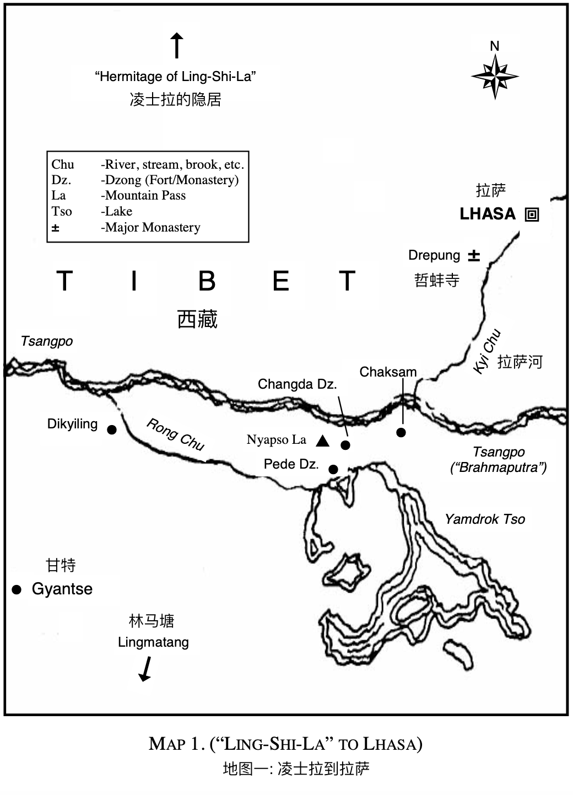

# 前言

生命瑜伽是生命的意识，它超越了其他瑜伽。生命瑜伽是自由，没有自由就没有生命的意识 - 只有小我被系统、知识和技巧所束缚着。&#x20;

随着我们的成长，你会看到欲望和追求的对立面、以及他们的阻力。所有的欲望和追求只是小我的延伸，都不是真实的。生命瑜伽就是要理解所有隐藏“真实”、隐藏生命的一切。因此它与所有类型的瑜伽完全不同，其他类型的瑜伽仅仅是一种系统，只有追求没有结果。因此“成为”（becoming）只是一种幻象。而“实象”是“当下”。&#x20;

我们必须意识到理解新鲜（事物）、尤其是不断更新的（事物）是非常困难的。我们知道头脑是由什么构成的，但就是构成头脑的这些东西导致我们抵抗新事物、抵抗真实。

所以在阅读此书的时候，最好能大声朗读并聆听，就像是在听别人朗读一样，不带抵抗、不带偏见地倾​​听，只有这样，头脑才能了解自己所有的对立面，自己的信念和捏造（的事实）。&#x20;

对于就要走上自由之路 - 走向生命瑜伽的你们，我现在要说的非常重要。&#x20;

大多数人是随便地听；他们只能听到自己想听到的东西，他们会屏蔽掉震撼、刺激到自己的条件反射、信念系统和观念的东西。他们只听让他们感到愉快、满足自己的条件反射的东西。

但如果我们只听能够抚慰我们、满足或证实我们信念系统和观念的东西，我们是不能真正的理解的。_倾听是一门艺术，没有偏见地倾听一切，没有搭建防御措施来保护我们的无知、保护我们坚定的信念、保护我们的原始的知识、保护我们的特质和观点，只是（纯粹地）倾听以寻找问题的真相。_因为结论或猜测不能解放我们，只有真理、只有感知到什么不是真相才能彻底地解放我们。头脑所构成的不是“真理”；真理是超越头脑的，因此在揭示真理前，头脑必须停止制造（观念概念）。

真相永远不会展现给狭隘、固执、被盲从的信念和知识条件束缚的人。&#x20;

头脑被混杂的个人结论、偏见和经验所困扰的人，是不可能收获生命瑜伽的。生命瑜伽就是爱和智慧 - 生命是自由且活跃的，而不仅仅是一个概念；概念是生命创造力的障碍。概念不过是小我及其条件限制的投射。&#x20;

因此聆听的时候，不要只听每个单词，要聆听里面内在的内容，至此你将发现关于自己的真相。当头脑从其臆造中得以解放的时候，真理就会显现。&#x20;

当你陷入日常挣扎、恐惧、担忧、家庭争吵、社会仇恨及挫败感的时候，你可能会觉得难以承受。所以你追求所谓的真理，作为一种解脱的途径，但是这种逃避的方式永远无法解决任何问题；它只会让头脑变得麻木，而困惑无明依旧存在。只要头脑试图通过（外在的）刺激 - 就是所谓的鼓舞激励，通过祈祷或重复祷告语来逃避（现实），是无法理解和认知自己的 - 这也是通往自由的关键。

自我认知是唯一的途径。各种逃避的方式只会让你脱离生命瑜伽的基本原则。

所以在聆听的过程里，积累观念概念并不会让你自由，结论、理论或推理也不能让你自由，这些都是对真理创造力的阻碍。只有了解自我及其所有的臆造，才能意识到自我认知才是通往真理的大门，才是通往生命瑜伽的大门。

